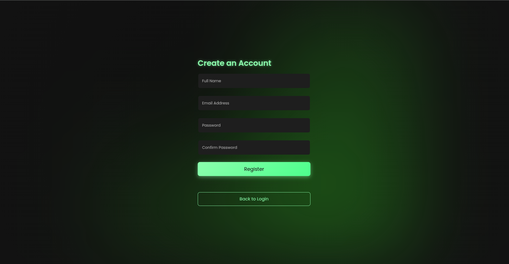
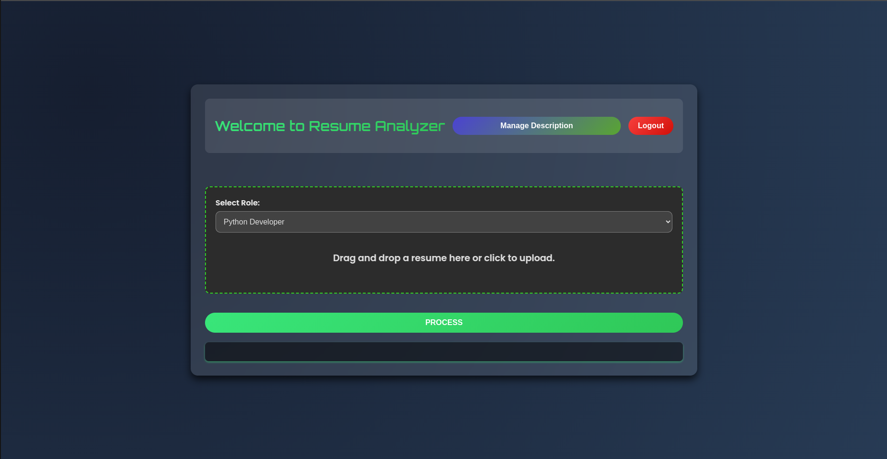
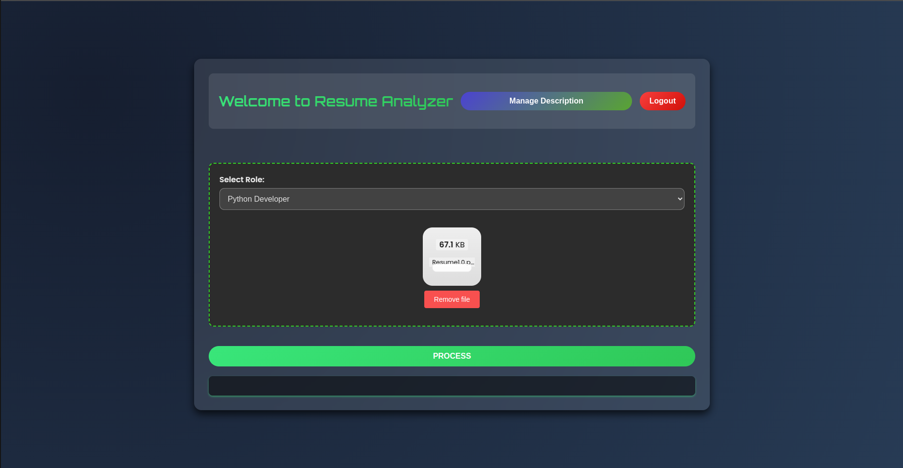
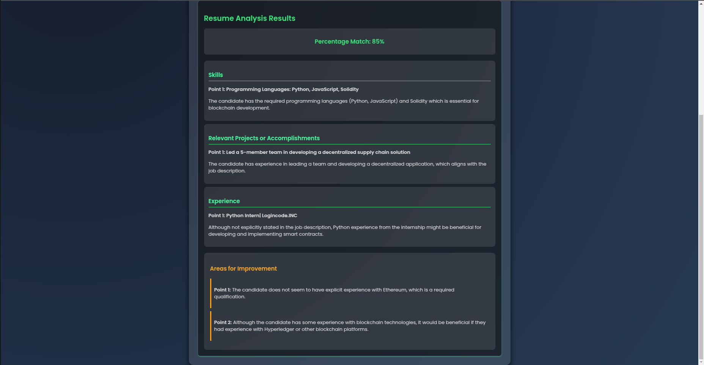

# AI-Powered Resume Match Analysis

An intelligent Flask-based web application that leverages state-of-the-art AI models to analyze and match resumes against job descriptions, providing detailed insights and recommendations for job seekers.

## 🌟 Key Features

### Intelligent Resume Analysis
- Advanced resume-to-job description matching using the Mistral LLM
- Semantic analysis powered by the nomic-embed-text embedding model
- Percentage match scoring with detailed similarity metrics
- Personalized improvement recommendations

### Secure User Management
- Robust user authentication system
- Secure password hashing using BCrypt
- Protected user sessions and data privacy

### Interactive Interface
- Intuitive drag-and-drop resume upload
- Dynamic job description management
- Real-time analysis results
- User-friendly dashboard

## 🛠️ Technology Stack

- **Backend Framework**: Flask (Python)
- **Database**: PostgreSQL
- **AI Models**: 
  - Mistral (via Ollama) for natural language processing
  - nomic-embed-text for text embeddings
- **Security**: BCrypt password hashing
- **Frontend**: HTML, CSS, JavaScript

## 📸 Application Screenshots








## 💡 How It Works

1. **User Authentication**
   - Register with secure credential storage
   - Login to access personalized dashboard
   - All user data securely stored in PostgreSQL

2. **Job Description Management**
   - Add and manage job descriptions
   - Store descriptions in the database
   - Easy access to saved descriptions

3. **Resume Analysis**
   - Upload resume through drag-and-drop interface
   - AI-powered comparison with selected job description
   - Generate comprehensive matching analysis

4. **Results and Insights**
   - View percentage match score
   - Detailed similarity breakdown
   - Specific improvement recommendations


## 🚀 Getting Started

1. Install Ollama                   [https://ollama.com/]
2. Pull Ollama Models 
    ollama pull mistral             [https://ollama.com/library/mistral]
    ollama pull nomic-embed-text    [https://ollama.com/library/nomic-embed-text]
3. Set-up Python virtual environment
4. Clone Repository                 [git clone https://github.com/ThakkerDhruv1408/AI-Resume-Analyzer.git]
5. install requiremetn libraris      
6. run the app 


## 🚀 Getting Started

### Prerequisites

- Python 3.8 or higher
- PostgreSQL database
- Ollama installed on your system

### Installation Steps

1. **Install Ollama**
   ```bash
   # Visit https://ollama.com/ and follow installation instructions for your OS
   ```

2. **Pull Required Ollama Models**
   ```bash
   # Pull Mistral model
   ollama pull mistral

   # Pull nomic-embed-text model
   ollama pull nomic-embed-text
   ```

3. **Set Up Python Virtual Environment**
   ```bash
   # Create virtual environment
   python -m venv venv

   # Activate virtual environment
   # For Windows
   .\venv\Scripts\activate
   # For Unix or MacOS
   source venv/bin/activate
   ```

4. **Clone the Repository**
   ```bash
   git clone [git clone https://github.com/ThakkerDhruv1408/AI-Resume-Analyzer.git]
   cd AI-Resume-Analyzer
   ```

5. **Install Required Libraries**
   ```bash
   pip install -r requirements.txt
   ```


6. **Run the Application**
   ```bash
   # Start the Flask development server
   flask run

   # The application will be available at http://localhost:5000
   ```

### Troubleshooting

- Ensure Ollama is running in the background before starting the application
- Check PostgreSQL service is active and accessible
- Verify all environment variables are properly set in .env file
- Restart the server.